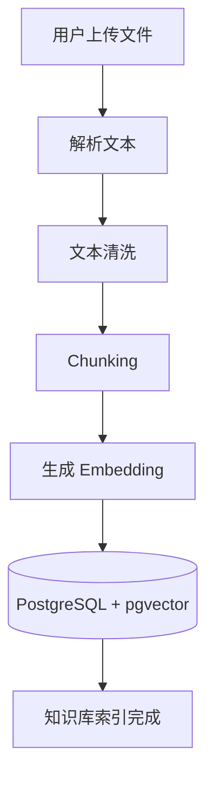
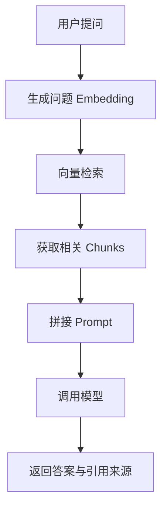
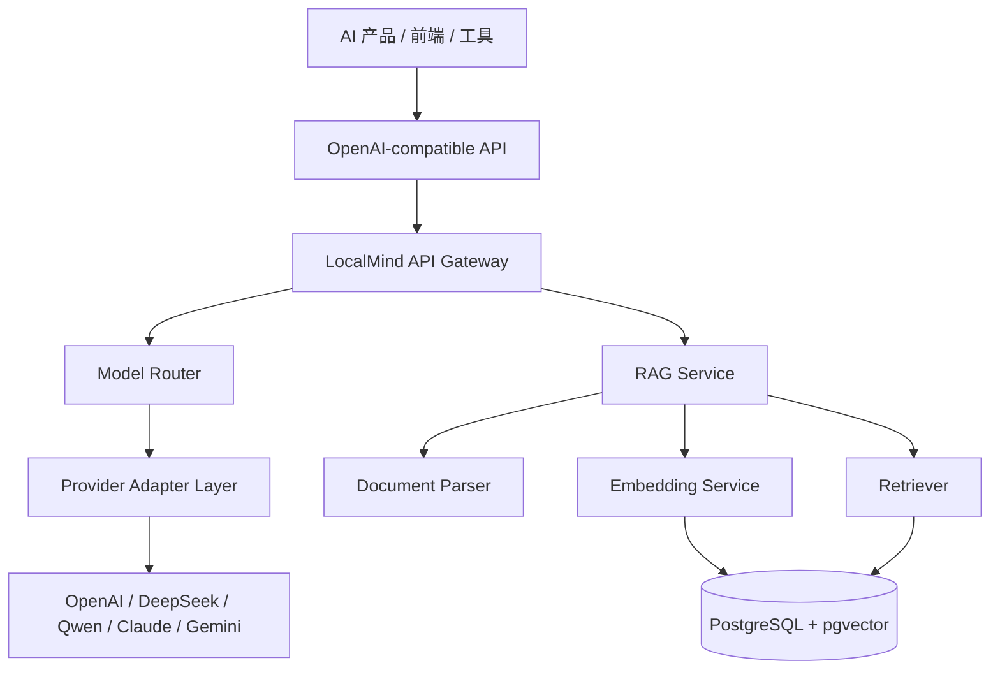

# LocalMind 产品规格说明

## 1. 项目概述

LocalMind 是一个面向 AI 应用开发的 OpenAI-compatible API Gateway 与 RAG Knowledge Base 系统。项目通过统一的 OpenAI 风格接口对外提供模型调用能力，并在内部完成多模型适配、知识库检索、Embedding、文档索引和响应格式转换。

项目的核心目标是沉淀一个可复用的 AI 后端基础设施，而不是仅完成单一聊天 Demo。后续 AI Chat、PDF 问答、知识库助手、多模型调用和其他 AI 产品均可基于该系统构建。

## 2. 产品定位

| 维度 | 定位 |
| --- | --- |
| 产品形态 | AI Gateway + RAG Knowledge Base |
| 接口风格 | OpenAI-compatible API |
| 主要用户 | 开发者、AI 产品调用方、系统管理员 |
| 核心能力 | 模型路由、Provider 适配、知识库检索、Embedding、统一响应 |
| 技术方向 | FastAPI、PostgreSQL、pgvector、Docker、RAG |

## 3. 建设目标

### 3.1 第一阶段：OpenAI-compatible API

第一阶段提供兼容 OpenAI 格式的基础 API，使支持 OpenAI Base URL 和 API Key 的客户端能够接入 LocalMind。该阶段重点完成 Chat API、Models API 和基础模型调用链路。

### 3.2 第二阶段：RAG Knowledge Base

第二阶段建设知识库能力，支持 PDF、Markdown、txt 等文档上传、解析、切块、Embedding 和向量检索，并提供基于知识库的问答接口。

### 3.3 第三阶段：Multi-provider AI Gateway

第三阶段扩展 Provider Adapter Layer，支持 OpenAI、DeepSeek、通义千问、Claude、Gemini 等模型提供商。外部接口保持 OpenAI-compatible，内部根据模型配置自动路由到对应厂商。

## 4. 用户角色

| 角色 | 使用场景 | 主要权限 |
| --- | --- | --- |
| 开发者 | 本地开发、模型测试、接口调试、知识库验证 | 调用 API、上传文档、查看调试结果 |
| AI 产品调用方 | 将 LocalMind 作为统一模型后端接入业务系统 | 使用 Base URL + API Key 调用服务 |
| 管理员 | 维护模型、密钥、日志、索引和系统配置 | 管理 Provider、API Key、Token 统计、文档索引 |

## 5. 核心功能

### 5.1 Chat API

提供 OpenAI-compatible Chat Completion 接口。

```http
POST /v1/chat/completions
```

请求示例：

```json
{
  "model": "deepseek-chat",
  "messages": [
    {
      "role": "user",
      "content": "解释一下 RAG"
    }
  ],
  "stream": false
}
```

响应示例：

```json
{
  "id": "chatcmpl-001",
  "object": "chat.completion",
  "choices": [
    {
      "message": {
        "role": "assistant",
        "content": "RAG 可以理解为 AI 先检索相关资料，再基于资料生成回答。"
      }
    }
  ]
}
```

### 5.2 Streaming Chat API

Chat API 支持流式输出。客户端将 `stream` 设置为 `true` 后，服务端以 SSE 或等价流式协议返回增量内容。

```json
{
  "stream": true
}
```

### 5.3 Embedding API

生成文本 Embedding，用于 RAG、向量搜索、语义检索和推荐场景。

```http
POST /v1/embeddings
```

请求示例：

```json
{
  "input": [
    "什么是 FastAPI？"
  ],
  "model": "text-embedding-3-small"
}
```

### 5.4 Models API

返回当前系统可用模型列表。

```http
GET /v1/models
```

响应示例：

```json
{
  "data": [
    { "id": "gpt-4.1-mini" },
    { "id": "deepseek-chat" },
    { "id": "qwen-plus" }
  ]
}
```

### 5.5 RAG Query API

基于知识库检索结果回答问题，并返回引用来源。

```http
POST /v1/rag/query
```

请求示例：

```json
{
  "query": "什么是线程？",
  "knowledge_base_id": "kb_001",
  "top_k": 5
}
```

响应示例：

```json
{
  "answer": "线程是 CPU 调度的最小单位。",
  "sources": [
    {
      "document_name": "os.pdf",
      "chunk_id": "chunk_123"
    }
  ]
}
```

## 6. RAG 工作流程

### 6.1 文档入库流程



### 6.2 问答流程



## 7. Provider Adapter Layer

Provider Adapter Layer 用于屏蔽不同模型厂商之间的接口差异。外部调用方始终使用 OpenAI-compatible 请求格式，内部 Adapter 负责将请求转换为目标厂商的参数格式，并将响应转换回统一结构。

需要适配的差异包括：

- API URL。
- 鉴权方式。
- 请求参数。
- 流式输出协议。
- 错误码。
- 响应结构。

Provider 结构以 `BaseProvider` 为统一抽象，各厂商通过独立 Provider 实现接入，包括 `OpenAIProvider`、`DeepSeekProvider`、`QwenProvider`、`ClaudeProvider` 和 `GeminiProvider`。

## 8. 系统架构



## 9. 建议目录结构

```
backend/
├── app/
│   ├── api/
│   │   ├── openai_routes.py
│   │   ├── rag_routes.py
│   │   └── knowledge_base_routes.py
│   ├── ai/
│   │   ├── providers/
│   │   │   ├── base.py
│   │   │   ├── openai_provider.py
│   │   │   ├── deepseek_provider.py
│   │   │   ├── qwen_provider.py
│   │   │   ├── claude_provider.py
│   │   │   └── gemini_provider.py
│   │   ├── services/
│   │   │   ├── chat_service.py
│   │   │   ├── embedding_service.py
│   │   │   ├── rag_service.py
│   │   │   └── model_router.py
│   │   └── prompts/
│   ├── rag/
│   │   ├── parser.py
│   │   ├── chunker.py
│   │   ├── retriever.py
│   │   └── indexer.py
│   ├── db/
│   ├── models/
│   ├── schemas/
│   ├── config/
│   └── main.py
├── uploads/
├── requirements.txt
└── docker-compose.yml
```

## 10. 数据模型概览

| 表名 | 用途 |
| --- | --- |
| `users` | 用户信息 |
| `api_keys` | API Key 管理 |
| `providers` | 模型提供商配置 |
| `documents` | 原始文件元数据 |
| `chunks` | 文本切块 |
| `embeddings` | 向量数据 |
| `chat_sessions` | 聊天会话 |
| `chat_messages` | 聊天消息 |

## 11. MVP 范围

第一版仅交付最小可用链路：

| 功能 | 接口或范围 |
| --- | --- |
| Chat API | `POST /v1/chat/completions` |
| Embedding API | `POST /v1/embeddings` |
| 文件上传 | `POST /knowledge-bases/{id}/documents` |
| RAG Query | `POST /v1/rag/query` |
| Provider | 仅接入 OpenAI |

## 12. 后续规划

### 第二阶段

- 接入 DeepSeek、通义千问、Claude、Gemini。
- 完善 Provider Adapter 抽象。
- 增加模型配置管理。

### 第三阶段

- 支持 Streaming。
- 增加 API Key 管理。
- 增加限流和 Redis。
- 增加 Token 统计。
- 完善日志和调用审计。

## 13. 暂不纳入 MVP 的范围

以下能力不进入第一版范围：

- MCP。
- 多 Agent。
- Kubernetes。
- 微服务。
- 多租户。
- 支付系统。

## 14. 项目价值

LocalMind 的核心价值在于提供一套可扩展的 AI 后端基础设施。它既能支持知识库问答和 AI Chat，也能作为后续 AI 产品的底层模型调用与 RAG 服务。项目训练重点包括 API 设计、Provider 适配、RAG 检索、数据库建模、日志配置、部署和工程化交付。
